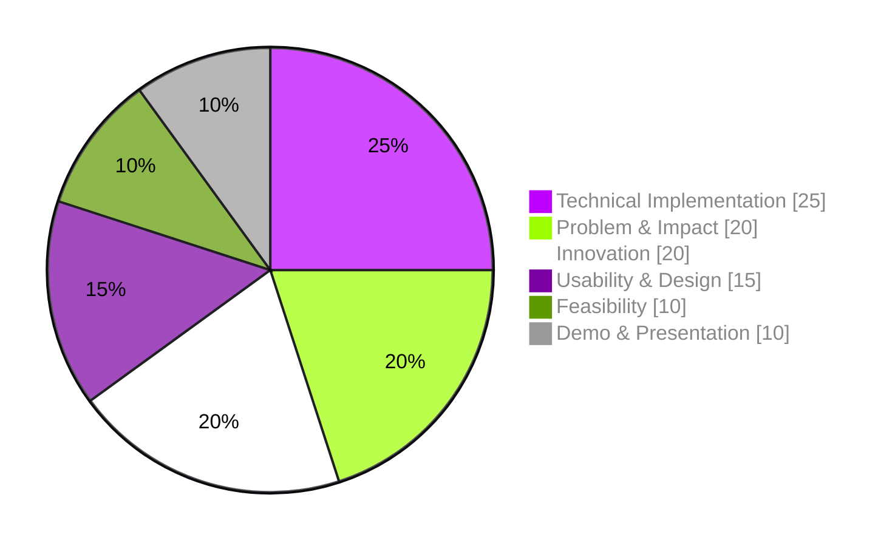

# ⚖️ Judging Criteria

### Build. Solve. **Demonstrate.**

[🏠 Home](README.md) · [💡 Problems](PROBLEMS.md) · [📜 Rules](RULES.md) · [📋 Submission Guide](SUBMISSION_GUIDELINES.md)

## 🏆 How Projects Are Evaluated

Every submitted project is evaluated by the judges on six weighted criteria:

## 📊 What Judges Look For

| Criterion | Weight | Judges will consider |
| :-- | :-: | :-- |
| 🛠️ **Technical Implementation** | **25%** | • How well the solution is technically implemented • Quality of the technical approach • Effective use of technologies, APIs, AI/ML, open-source tools, or other components where appropriate • Whether the team can explain how their implementation works |
| 🎯 **Problem & Impact** | **20%** | • How clearly the team understands the selected problem • How effectively the solution addresses the problem • The potential usefulness and impact of the solution |
| 💡 **Innovation** | **20%** | • Creativity of the solution • Originality of the approach • How intelligently technologies are combined to solve the problem |
| 🎨 **Usability & Design** | **15%** | • Ease of use • User experience • Clarity of the interface and overall solution • Whether users can understand how to use the product |
| 📈 **Feasibility** | **10%** | • Whether the solution is practical • Whether it could realistically be developed further • Potential for real-world use |
| 🎤 **Demo & Presentation** | **10%** | • How clearly the team explains the problem and solution • Quality of the demonstration • Ability to explain the technical implementation • How effectively the team presents and demonstrates the working prototype |
| **Total** | **100%** | |

> [!IMPORTANT]
> **AI is allowed**, but teams must understand and explain their implementation.

## 📌 Important

* Judges will evaluate projects using the criteria above.
* Teams should be prepared to **demonstrate and explain their implementation**.
* AI and open-source technologies are allowed, but teams should understand the technologies they use.
* The submitted project should include a **working prototype** and required documentation.

### 🚀 Build Something Meaningful.

**OpenHack'26 — MUET SZAB Campus, Khairpur**

**Build. Solve. Demonstrate. ❤️**

