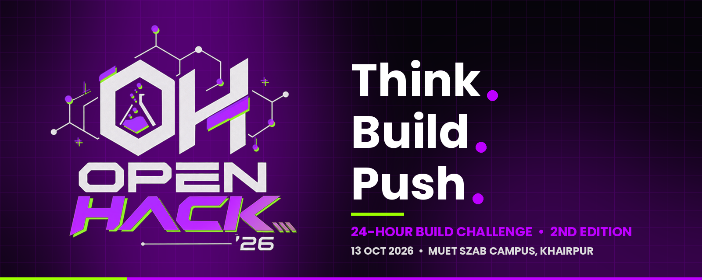
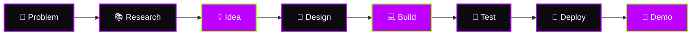
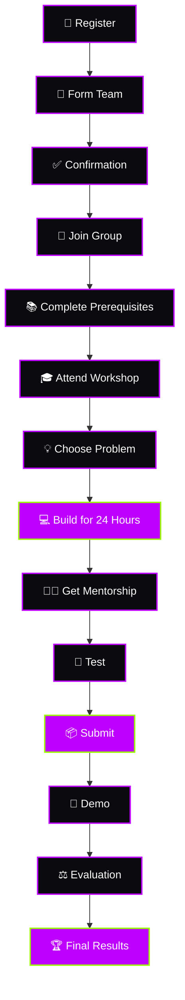

<div align="center">



<a href="https://git.io/typing-svg">
  
</a>

<br/>


**Organized by the Department of Software Engineering, MUET SZAB Campus, Khairpur**

[📋 Problems](PROBLEMS.md) · [📜 Rules](RULES.md) · [📦 Submit](SUBMISSION_GUIDELINES.md) · [👥 Teams](TEAM_GUIDELINES.md) · [⚖️ Judging](JUDGING.md) · [🤖 AI Policy](AI_AND_OPEN_SOURCE.md) · [👨‍🏫 Mentorship](MENTORSHIP.md)

</div>


## 🧭 Table of Contents

- [What is OpenHack'26?](#-what-is-openhack26)
- [Event at a Glance](#-event-at-a-glance)
- [Choose Your Challenge](#-choose-your-challenge)
- [Difficulty Levels](#-difficulty-levels)
- [Build With What You Know](#%EF%B8%8F-build-with-what-you-know)
- [Mentorship](#-mentorship)
- [Pre-Submission Checklist](#-pre-submission-checklist)
- [How to Submit](#-how-to-submit)
- [Judging](#-judging)
- [Participant Journey](#-participant-journey)
- [Repository Structure](#-repository-structure)
- [Important Documents](#-important-documents)
- [What You Will Gain](#-what-you-will-gain)


## 🧪 What is OpenHack'26?

OpenHack'26 is a **24-hour build challenge** designed around **real-world problem solving**, not traditional programming assignments.

Teams review a collection of problem statements across different technology domains, pick the one they can solve best, and take it from **idea to a working, demonstrable prototype**.

> **The goal is not simply to write code. The goal is to build a meaningful technology solution to a real-world problem.**




## 📌 Event at a Glance

| | Details |
| :-- | :-- |
| 🎯 **Event** | OpenHack'26 Hackathon — 2nd Edition |
| 🏫 **Organizer** | Department of Software Engineering, MUET SZAB Campus |
| 📍 **Location** | MUET SZAB Campus, Khairpur |
| 📅 **Date** | 13 October 2026 |
| ⏰ **Start** | **9:00 AM** |
| ⏱️ **Duration** | 24-Hour Build Challenge |
| 👥 **Participants** | University / College Students |
| 👨‍💻 **Team Size** | 2–3 Students |
| 🐙 **Technology Partner** | GitHub |
| 🤖 **AI** | Allowed & Encouraged |
| 🌐 **Open Source** | Allowed & Encouraged |

> 📢 Additional schedule details and official announcements will be shared by the organizing team.


## 💡 Choose Your Challenge

### 🔥 5 Categories × 3 Problems = 15 Problems

Review every problem, then choose the one you believe you can solve effectively.

> 🔁 **Multiple teams may choose the same problem.** Each team is evaluated independently against the judging criteria.

<table>
  <tr>
    <td align="center" width="20%">
      <h3>🏥</h3>
      <b>HealthTech</b><br/><br/>
      <sub>Healthcare access<br/>Prevention<br/>Health management<br/>Medical support</sub>
    </td>
    <td align="center" width="20%">
      <h3>🎓</h3>
      <b>EdTech</b><br/><br/>
      <sub>Education<br/>Learning<br/>Student productivity<br/>Career &amp; skill development</sub>
    </td>
    <td align="center" width="20%">
      <h3>🌾</h3>
      <b>AgriTech &amp; Food</b><br/><br/>
      <sub>Farming &amp; crops<br/>Irrigation<br/>Food supply<br/>Agricultural markets</sub>
    </td>
    <td align="center" width="20%">
      <h3>🌍</h3>
      <b>Climate &amp; Disaster Resilience</b><br/><br/>
      <sub>Climate &amp; floods<br/>Water &amp; waste<br/>Pollution<br/>Disaster management</sub>
    </td>
    <td align="center" width="20%">
      <h3>🏙️</h3>
      <b>Smart Communities &amp; Public Services</b><br/><br/>
      <sub>Local transportation<br/>Civic services<br/>Public safety<br/>Accessibility</sub>
    </td>
  </tr>
</table>

📋 **See all 15 problem statements in [`PROBLEMS.md`](PROBLEMS.md).**


## ⚡ Difficulty Levels

Each problem statement is published with its difficulty level.

| Level | Expected Complexity |
| :-- | :-- |
| 🟢 **Medium** | Web/Mobile + APIs + Database + Basic AI |
| 🟡 **Hard** | Multiple Data Sources + AI/ML + Meaningful Logic |
| 🔴 **Challenge** | Real-Time Data + AI/ML + Maps / IoT / Optimization / Integration |


## 🛠️ Build With What You Know

No forced stack. Use whatever helps you ship a working solution.

<div align="center">

| 💻 Any language | ⚛️ Any framework | 🤖 AI tools & models | 🔌 APIs |
| :-: | :-: | :-: | :-: |
| **📦 Open-source libs** | **🐙 GitHub** | **☁️ Cloud services** | **🗄️ Databases** |
| **🗺️ Maps & location** | **📡 IoT** | **🧠 AI / ML** | **🔧 Anything appropriate** |

</div>

> [!IMPORTANT]
> **🤖 AI is allowed and encouraged, but if you use AI, you must understand what you build.**
> Be ready to explain your implementation, architecture, technologies, and key technical decisions during evaluation.


## 👨‍🏫 Mentorship

Mentors are available **physically and online** throughout the hackathon.

| Area | Guidance |
| :-- | :-- |
| 💻 Technical Development | Implementation & debugging |
| 🏗️ Architecture | System design & technical decisions |
| 🤖 AI/ML | Models & AI integration |
| 💡 Product | Problem & solution validation |
| 🎨 UI/UX | User experience & interface |
| 🎤 Presentation | Demo & pitch |

> **Mentors guide. Teams build.**


## ✅ Pre-Submission Checklist

- [ ] Main feature works
- [ ] Solution addresses the selected problem
- [ ] Results / data are reasonable
- [ ] Interface is understandable
- [ ] Team can explain the technical implementation
- [ ] Prototype can be demonstrated
- [ ] README is complete
- [ ] AI / open-source usage is disclosed


## 📦 How to Submit

**Think. Build. Push.** Each team creates **its own folder** inside `submissions/`, named with the **registered team name**.

```text
submissions/
└── Your-Team-Name/
    └── README.md
```

<details>
<summary><b>📄 Required README sections (click to expand)</b></summary>

<br/>

```markdown
# Project Name

## Problem Statement

## Our Solution

## Technologies Used

## Key Features

## How It Works

## Challenges Faced

## Future Improvements

## AI / Open-Source Disclosure

## Team Members
```

</details>

📎 The **demo video, PPT, live deployment URL**, and other required materials are collected through the **official project submission form**.

📖 Full GitHub contribution and submission steps: [`SUBMISSION_GUIDELINES.md`](SUBMISSION_GUIDELINES.md)


## 🏆 Judging

Projects are evaluated with the official OpenHack'26 criteria ([`JUDGING.md`](JUDGING.md)).

| Criterion | Weight | |
| :-- | --: | :-- |
| 🛠️ Technical Implementation | **25%** | `██████████` |
| 🎯 Problem & Impact | **20%** | `████████░░` |
| 💡 Innovation | **20%** | `████████░░` |
| 🎨 Usability & Design | **15%** | `██████░░░░` |
| 📈 Feasibility | **10%** | `████░░░░░░` |
| 🎤 Demo & Presentation | **10%** | `████░░░░░░` |
| **TOTAL** | **100%** | |

**Judges may review:** GitHub repository · README · working prototype · demonstration · submitted video/URLs · presentation · technical explanation


## 👥 Participant Journey




## 📁 Repository Structure

```text
OpenHack26/
├── assets/
│   ├── banner.png
│   ├── divider.png
│   └── logo.png
├── README.md
├── PROBLEMS.md
├── RULES.md
├── SUBMISSION_GUIDELINES.md
├── TEAM_GUIDELINES.md
├── JUDGING.md
├── AI_AND_OPEN_SOURCE.md
├── MENTORSHIP.md
├── CONTRIBUTING.md
├── CODE_OF_CONDUCT.md
├── LICENSE
└── submissions/
    ├── Team-Name-1/
    │   └── README.md
    ├── Team-Name-2/
    │   └── README.md
    └── ...
```


## 📚 Important Documents

| Document | Purpose |
| :-- | :-- |
| 📋 [`PROBLEMS.md`](PROBLEMS.md) | Official hackathon problem statements |
| 📜 [`RULES.md`](RULES.md) | Hackathon rules & policies |
| 📦 [`SUBMISSION_GUIDELINES.md`](SUBMISSION_GUIDELINES.md) | How to submit your project |
| 👥 [`TEAM_GUIDELINES.md`](TEAM_GUIDELINES.md) | Team formation & collaboration |
| ⚖️ [`JUDGING.md`](JUDGING.md) | Judging criteria |
| 🤖 [`AI_AND_OPEN_SOURCE.md`](AI_AND_OPEN_SOURCE.md) | AI & open-source guidelines |
| 👨‍🏫 [`MENTORSHIP.md`](MENTORSHIP.md) | Mentorship information |
| 🤝 [`CONTRIBUTING.md`](CONTRIBUTING.md) | GitHub contribution workflow |
| 🧑‍💻 [`CODE_OF_CONDUCT.md`](CODE_OF_CONDUCT.md) | Community conduct |


## 🌟 What You Will Gain

| | | |
| :-- | :-- | :-- |
| 🚀 Build a real project under a real deadline | 💼 Portfolio-ready work | 👥 Team-based development experience |
| 🤖 Work with AI in meaningful ways | 🌐 Work with open-source tech | 🧠 Real-world problem solving |
| 👨‍🏫 Learn from mentors | 🎤 Sharper presentation skills | 🐙 A stronger GitHub profile |

🤝 …and connect with developers, students, and professionals.


<div align="center">


### Don't just build another project.
### Find a real problem. Build a meaningful solution. Make it work.

```text
$ git clone https://github.com/<org>/OpenHack26.git
$ cd OpenHack26/submissions && mkdir Your-Team-Name
$ echo "Think. Build. Push. 🚀"
```

📍 **MUET SZAB Campus, Khairpur** · 📅 **13 October 2026** · ⏰ **9:00 AM**

**🐙 Built with GitHub • Powered by Students • Driven by Problems**

**OpenHack'26 — Build. Solve. Demonstrate.**

</div>

