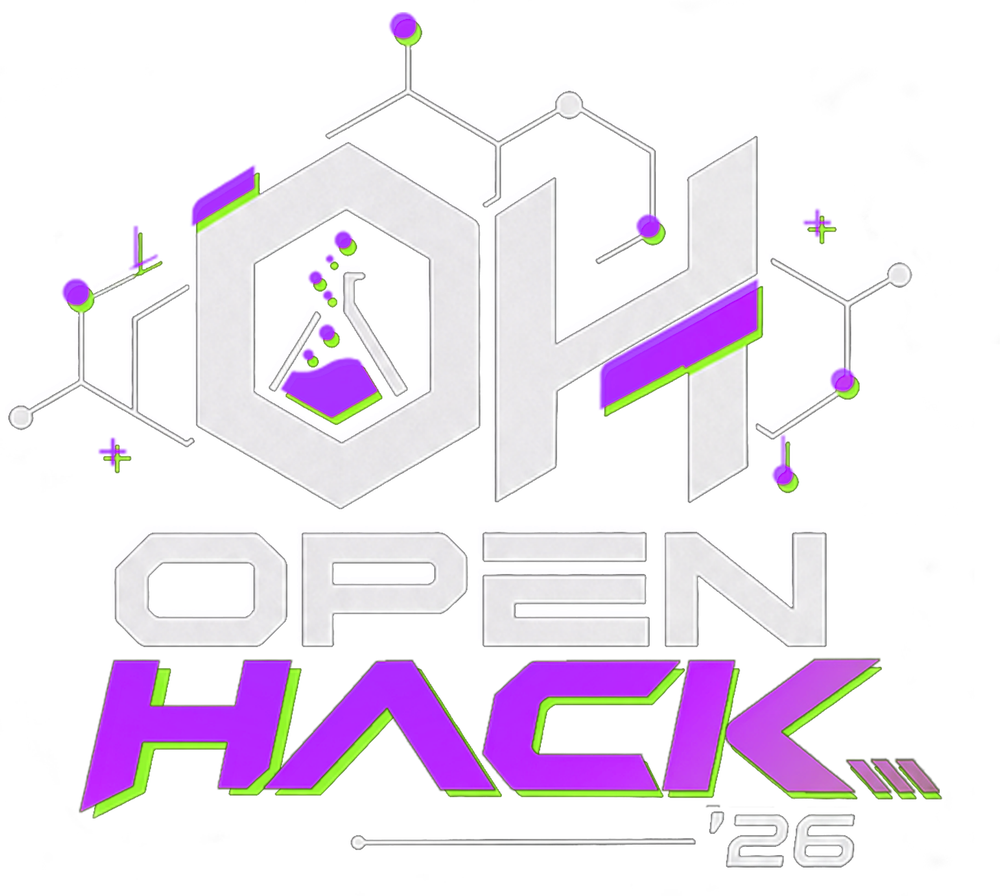
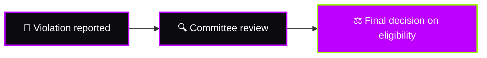

<div align="center">



# 📜 Rules & Policies

### Build Fair. Build Yourself. Build With Impact.


[🏠 Home](README.md) · [📋 Problems](PROBLEMS.md) · [📦 Submit](SUBMISSION_GUIDELINES.md) · [⚖️ Judging](JUDGING.md) · [🤖 AI Policy](AI_AND_OPEN_SOURCE.md) · [🧑‍💻 Conduct](CODE_OF_CONDUCT.md)

</div>


## ⚡ Rules at a Glance

<table>
<tr>
<td width="50%" valign="top">

### ✅ You CAN
- Form a team of **2–3 students**
- Pick **any one** of the 15 problems
- Choose the **same problem** as other teams
- Use **AI tools** and **open-source** resources
- Get **guidance from mentors**
- Arrive prepared with **templates, boilerplate & knowledge**

</td>
<td width="50%" valign="top">

### 🚫 You CANNOT
- **Switch teams** after confirmation
- **Outsource** or pay someone to build your project
- Submit a **pre-built / previously completed** project
- **Plagiarize** or misrepresent others' work
- Commit **API keys, passwords or secrets**
- Use technology to **attack, steal or cause harm**

</td>
</tr>
</table>

> [!IMPORTANT]
> **AI can assist your work. It cannot replace your understanding of the project.** Be ready to explain every part of what you submit.


## 🧭 Table of Contents

| # | Section | # | Section |
| :-: | :-- | :-: | :-- |
| 1 | [👥 Team Rules](#r1) | 11 | [👥 Team Contribution](#r11) |
| 2 | [💡 Problem Selection](#r2) | 12 | [🔐 Accounts & Credentials](#r12) |
| 3 | [⏱️ Hackathon Development](#r3) | 13 | [⚠️ Responsible Technology Use](#r13) |
| 4 | [🤖 AI Usage](#r4) | 14 | [📤 Submission Requirements](#r14) |
| 5 | [🚫 No External Development](#r5) | 15 | [⏰ Submission Deadline](#r15) |
| 6 | [📦 Pre-Built Projects](#r6) | 16 | [🏆 Judging](#r16) |
| 7 | [🌐 Open-Source Usage](#r7) | 17 | [🎤 Demo & Technical Explanation](#r17) |
| 8 | [🤖 AI & Open-Source Disclosure](#r8) | 18 | [🚨 Disqualification](#r18) |
| 9 | [🐙 GitHub Submission](#r9) | 19 | [🤝 Professional Conduct](#r19) |
| 10 | [📝 Originality & Plagiarism](#r10) | ✅ | [Final Checklist](#final-checklist) |


<a id="r1"></a>
## 1. 👥 Team Rules

### Team Size

Each team must consist of:

> **2–3 students**

Teams must be formed and registered through the official registration process.

### 🔒 No Team Switching

Once a team has been officially registered and confirmed:

* Members cannot switch between teams.
* A member cannot join another registered team.
* New members cannot be added after team confirmation unless explicitly approved by the organizing committee.

> [!WARNING]
> **Form your team carefully before registration.**


<a id="r2"></a>
## 2. 💡 Problem Selection

There will be:

### 🔥 5 Categories × 3 Problems = 15 Problems

Teams may review all available problem statements and select **any one problem** they want to solve.

### 🔁 Same Problem is Allowed

Multiple teams may select the same problem.

Teams are **not required to have unique problem statements**.

Each team's solution will be evaluated independently according to the official judging criteria.


<a id="r3"></a>
## 3. ⏱️ Hackathon Development

OpenHack'26 is a:

> **24-Hour Build Challenge**

The hackathon starts at:

| 📅 Date | ⏰ Start Time |
| :-: | :-: |
| **13 October 2026** | **9:00 AM** |

Teams are expected to develop their solution during the official hackathon period.

The organizing team will announce the final submission deadline and other schedule details.


<a id="r4"></a>
## 4. 🤖 AI Usage

### AI is Allowed

Teams are allowed and encouraged to use AI tools where they meaningfully contribute to their solution.

Examples include:

* ChatGPT
* GitHub Copilot
* Gemini
* Claude
* AI APIs
* AI/ML models
* Other development assistants

### 🧠 Understand What You Build

Using AI does **not** remove the team's responsibility for its project.

Teams must understand their:

* Code
* Architecture
* AI implementation
* Technologies
* APIs
* Technical decisions

Judges may ask teams to explain their implementation during evaluation.

> [!IMPORTANT]
> **AI can assist your work. It cannot replace your understanding of the project.**


<a id="r5"></a>
## 5. 🚫 No External Development

Teams must build their own project.

The following is **not allowed**:

* Asking another person outside the registered team to develop the project.
* Paying someone to build the project.
* Getting another developer to implement the core solution.
* Submitting a project primarily developed by someone else.

> [!CAUTION]
> If a team is found to have outsourced its project development, the organizing committee may **disqualify the team from the competition**.

### 👨‍🏫 Mentors Are Different

Mentors are allowed to:

* Give technical guidance
* Suggest approaches
* Help identify problems
* Explain technologies
* Review ideas
* Provide general debugging guidance

However:

> **Mentors guide. Teams build.**

Mentors should not build the team's project on their behalf.


<a id="r6"></a>
## 6. 📦 Pre-Built Projects

Teams should develop their hackathon solution during the official challenge period.

Submitting a previously completed project as the hackathon solution is not allowed.

However, teams may come prepared with:

* Knowledge of technologies
* Development environments
* General templates/boilerplate
* Familiarity with frameworks
* Research knowledge
* Learning resources

The **actual hackathon solution** should be developed as part of the challenge.


<a id="r7"></a>
## 7. 🌐 Open-Source Usage

Open-source technologies are allowed and encouraged.

Teams may use:

* Open-source libraries
* Frameworks
* APIs
* SDKs
* Models
* Development tools

Teams are responsible for respecting the applicable licenses and usage requirements of the resources they use.


<a id="r8"></a>
## 8. 🤖 AI & Open-Source Disclosure

Teams must disclose significant use of:

* AI tools
* AI-generated code
* AI models
* External APIs
* Open-source projects or libraries

The disclosure should be included in the project README.

See [`AI_AND_OPEN_SOURCE.md`](AI_AND_OPEN_SOURCE.md) for detailed guidance.


<a id="r9"></a>
## 9. 🐙 GitHub Submission

Each team will create its own folder inside:

```text
submissions/
```

using its registered team name.

Example:

```text
submissions/
└── Team-Alpha/
    └── README.md
```

Teams must follow the official submission structure and instructions provided in [`SUBMISSION_GUIDELINES.md`](SUBMISSION_GUIDELINES.md).


<a id="r10"></a>
## 10. 📝 Originality & Plagiarism

Teams must submit work that they can legitimately claim as their own.

The following may result in disqualification:

* Copying another team's solution
* Submitting another person's project
* Misrepresenting someone else's work as your own
* Significant plagiarism without proper attribution
* Falsifying project contributions or technology usage

Using open-source resources is allowed when properly used and attributed.


<a id="r11"></a>
## 11. 👥 Team Contribution

Every registered team member should contribute meaningfully to the project.

Teams should be able to explain:

* Who worked on what
* How the system was developed
* Major technical decisions
* Their individual contributions

Judges or organizers may ask team members about their contribution.


<a id="r12"></a>
## 12. 🔐 Accounts & Credentials

Teams must not expose sensitive information in their repositories.

Do **not** commit:

```text
API keys
Passwords
Access tokens
Private credentials
Database passwords
Secret keys
```

Use environment variables or appropriate secret-management methods.


<a id="r13"></a>
## 13. ⚠️ Responsible Technology Use

Teams must use technology responsibly.

Projects should not intentionally:

* Attack systems
* Steal credentials
* Access unauthorized data
* Deploy malicious software
* Violate privacy
* Cause intentional harm
* Break applicable laws or institutional policies

Security-related projects should remain within the intended hackathon scope and authorized environments.


<a id="r14"></a>
## 14. 📤 Submission Requirements

Before submitting, teams should ensure that their project includes the required materials.

### Repository

* [ ] Team folder created
* [ ] Project README included
* [ ] Problem statement identified
* [ ] Solution explained
* [ ] Technologies listed
* [ ] Key features documented
* [ ] Challenges documented
* [ ] AI/open-source usage disclosed

### Submission Form

Additional materials such as:

* 🎥 Demo video
* 📊 PPT
* 🌐 Live deployment URL
* 🔗 Project repository URL
* Other required information

will be submitted through the official project submission form.


<a id="r15"></a>
## 15. ⏰ Submission Deadline

The final submission deadline will be announced by the organizing team.

Teams are responsible for submitting their project before the announced deadline.

Late submissions may be handled according to the final decision of the organizing committee.


<a id="r16"></a>
## 16. 🏆 Judging

All submitted projects will be evaluated according to the official OpenHack'26 judging criteria.

| Criterion | Weight | |
| :-- | --: | :-- |
| 🛠️ Technical Implementation | **25%** | `██████████` |
| 🎯 Problem & Impact | **20%** | `████████░░` |
| 💡 Innovation | **20%** | `████████░░` |
| 🎨 Usability & Design | **15%** | `██████░░░░` |
| 📈 Feasibility | **10%** | `████░░░░░░` |
| 🎤 Demo & Presentation | **10%** | `████░░░░░░` |
| **TOTAL** | **100%** | |

See [`JUDGING.md`](JUDGING.md) for the detailed evaluation criteria.


<a id="r17"></a>
## 17. 🎤 Demo & Technical Explanation

Teams must be prepared to demonstrate their working solution.

During evaluation, judges may ask about:

| | | |
| :-- | :-- | :-- |
| The selected problem | The proposed solution | System architecture |
| Technologies | Code | AI usage |
| APIs | Data | Technical challenges |
| Team contributions | Future improvements | |

Teams should be able to explain their project clearly and honestly.


<a id="r18"></a>
## 18. 🚨 Disqualification

A team may be disqualified for serious violations including, but not limited to:

* Outsourcing project development
* Plagiarism
* Submitting another person's project
* Team switching without approval
* Misrepresenting project work
* Unauthorized access or malicious activity
* Serious violation of hackathon rules
* Providing false information to organizers or judges



> [!CAUTION]
> The organizing committee will review reported violations and make the **final decision** regarding competition eligibility.


<a id="r19"></a>
## 19. 🤝 Professional Conduct

All participants are expected to maintain a respectful and professional environment.

Participants should:

* Respect other teams
* Respect mentors and judges
* Communicate professionally
* Avoid harassment or discrimination
* Follow venue and event instructions
* Respect university facilities and resources

See [`CODE_OF_CONDUCT.md`](CODE_OF_CONDUCT.md) for the complete community guidelines.


<a id="final-checklist"></a>
# ✅ Final Checklist

Before starting your build, make sure you understand:

* [ ] My team has 2–3 members.
* [ ] My team is officially registered.
* [ ] I understand the no-team-switching rule.
* [ ] I understand that multiple teams can choose the same problem.
* [ ] I understand the 24-hour challenge format.
* [ ] I know AI tools are allowed.
* [ ] I understand that my team must understand its AI-generated work.
* [ ] I know external development/outsourcing is not allowed.
* [ ] I understand the open-source requirements.
* [ ] I know how to submit the project.
* [ ] I understand the judging criteria.


<div align="center">

### 🔥 Build It Yourself. Learn From It. Own Your Solution.

**Think. Build. Push.**

**OpenHack'26 — Build. Solve. Demonstrate. 🚀**

</div>

